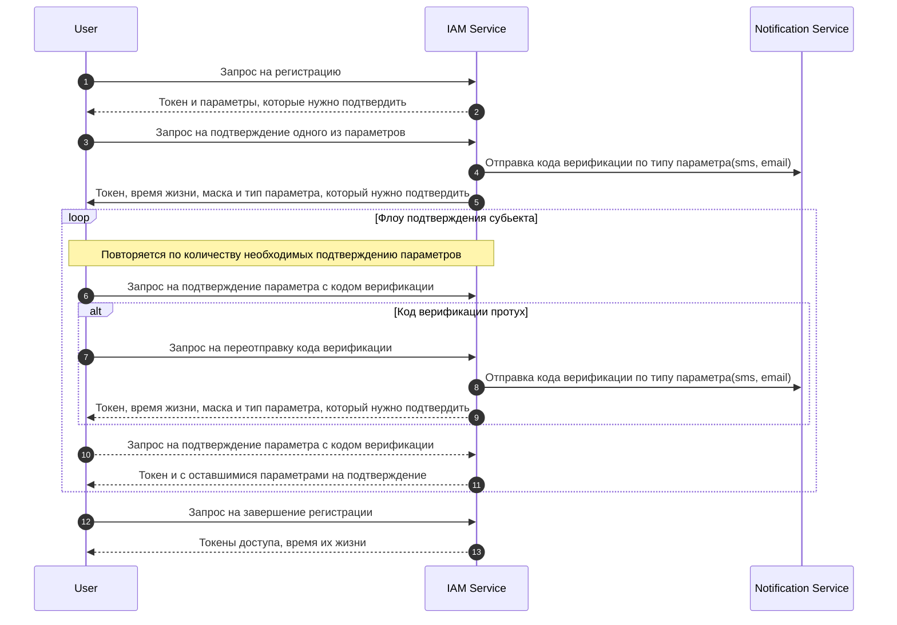
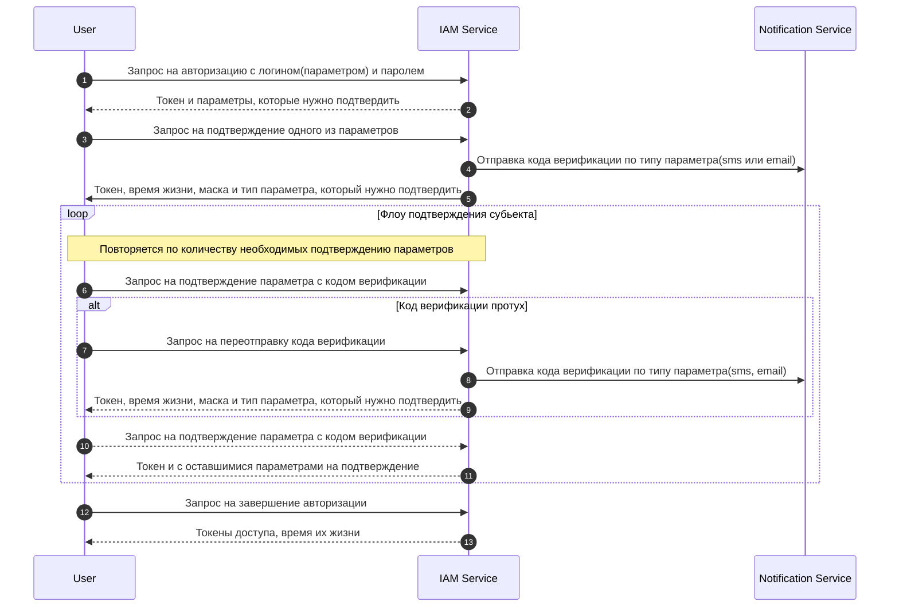
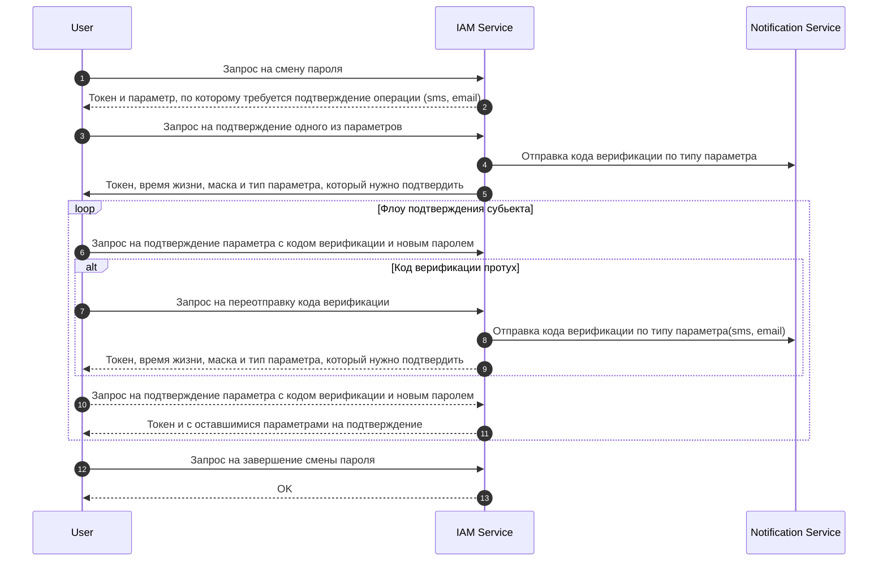

# IAM Service

[Open API Scheme](./api.md)

[Swagger Scheme](https://localhost:3001/api)

## Оглавление

- [IAM Service](#iam-service)
  - [Оглавление](#оглавление)
  - [Мотивация](#мотивация)
  - [Разработка](#разработка)
  - [Модульность](#модульность)
    - [Вспомогательные модули](#вспомогательные-модули)
    - [Модули-контроллеры](#модули-контроллеры)
    - [Главный модуль](#главный-модуль)
  - [Стороннее ПО](#стороннее-по)
    - [Keycloak](#keycloak)
      - [Описание](#описание)
      - [Realms](#realms)
      - [Users](#users)
      - [Clients](#clients)
      - [Roles](#roles)
    - [Etcd](#etcd)
      - [Настройки реалмов](#настройки-реалмов)
    - [Vault](#vault)
    - [Swagger](#swagger)
  - [Флоу](#флоу)
    - [Регистрация](#регистрация)
    - [Аутентификация](#аутентификация)
    - [Сброс пароля](#сброс-пароля)
    - [Переотправка кода](#переотправка-кода)
    - [Обновление доступа](#обновление-доступа)

## Мотивация

Цель сервиса - регистрация, авторизация и восстановление доступа пользователям с интеграцией стороннего ПО Keycloak.

## Разработка

Сервис разработан на NesJS, особенностью которого является модульность и поддержка DI(Dependency Injection).

В сервисе используется стороннее ПО Vault, Etcd и Keycloak.

## Модульность

Сервис разбит на модули, отвечающие за разные аспекты внутри.

### Вспомогательные модули

- **Affirmatin** - отвечает за валидацию 2FA кодов. (Отправка кодов по email/phone и их валидация)
- **Common** - модуль со статическими зависимостями. (instance_id, service_name, spec_version и т.д.)
- **Event-Tranporter** - отвечает за отправку событий в Kafka. Используется для отправки сообщений о завершенной регистрации, о том, что необходимо отправить код 2FA по email или phone.
- **Jwt** - отвечает за генерацию, валидацию, шифровку и расшифровку Jwt-токенов. Используется для генерации токенов регистрации, аутентификации, восстановления пароля.
- **Kafka** - модуль для работы с Kafka.
- **Keycloak** - модуль для работы с Keycloak. Отвечает за создание, изменение, получение, аутентификацию, авторизацию пользователя в Keykcloak.
- **internal-client** - модуль для работы с методами внутренней спеки.
- **Vault** - модуль для работы с Vault.
- **Redis** - модуль для работы с Redis.
- **Heath-reporter** - используется для оповещания состояния сервиса на текущий момент. С определённым интервалом отправляет данные о своём состянии в Monitor Service.
  
### Модули-контроллеры

- **Service-router** - модуль для внутренних методов сервиса.
- **Recovery** - модуль для восстановления пароля, переотправки кода 2FA и обновления токена доступа(access_token) через токен обновления (refresh_token).
- **Registration** - отвечает за флоу регистрации пользователя.
- **Authentication** - отвечает за аутентификацию пользователя в системе.

### Главный модуль

- **App** - В нём происходят подключение всех основных и вспомогательных модулей системы (Логгер, Конфиг, Rate Limiter, Метрики и все вышеперечисленные модули)

## Стороннее ПО

### Keycloak

#### Описание

 Система для хранения и манипуляции данными пользователей. Применяется для создания и хранения учетных данных пользователей. Пользователи разделены по, так называемым, реалмам. Пользователь одного реалма может получить доступ лишь к сервису, к которому прикреплён его реалм. (сервис p2p = реалм p2p-stage/prod)

#### Realms

Данная сущность делит область доступа пользователям созданным в рамках данной сущности. Пользователи разных реалмов не пересекаются. В данном случае реалмы будут делиться на сервисы с разной пользовательской базой.

Для использования клиента требуется сохранить его secret_key из keycloak в ectd.
Далее необходимо для каждого нового реалма создать в etcd запись с действиями, которые нужно совершить пользователю в данном реалме для регистрации. По умолчанию это ['phone', 'email'].

Иначе пользователю не выйдет зарегистрироваться.

В настройках сессий (Realm Settings/Sessions) необходимо проставить настройки у SSO Session Idle и SSO Session Max. Эти данные отвечаеют за время жизни refresh_token.

#### Users

В нашем случае для шифрования пароля мы используем bcrypt. Данное свойство настраивается во вкладке реалма Authentication вкладки Policies/Password policy/Hashing Algorithm.

#### Clients

Для операций с пользователями из вне используются сущности клиента.

Для настройки клиента требуется указать Capability config с Service Accounts Roles. Данная опция позволяет делать запросы от имени клиента в Keycloak через проброс его ключа.

Ключ находится во вкладке Keys данного клиента.

В каждом реалме должен быть создан клиент по шаблону `${service-name}-${cluster}` ( примеры: p2p-stage, p2p-prod ).

В настройках клиента нужно поставить флаг "Service accounts roles".

В Credentials скопировать secret_key и сохранить в хранилище vault по пути keycloak_clients. После - создать ключ по имени клиента и положить туда secret_key.

#### Roles

Для того, что зарегистрировать, авторизовать пользователя клиентом - ему необходимо добавить роли. В Keycloak есть базовые и композитные роли. Для добавления роли клиенту - необходимо создать композитную роль и добавить к ей базовые. Пример:

   1. Создаётся композитная роль. Назовём admin.
   2. Внутри неё во вкладке Associated Roles(/Actions/Add assciated roles/Filter by clients) для менджмента пользователей необходимо добавить базовые роли:
         'realm-management manage-users'
         'realm-management query-users'
         'realm-management view-users'

Композитная роли доступны в контексте композитной роли.

Составную роль можно создать в Realm roles или конкретно в профиле клиента. После создания она будет доступны везде.

### Etcd

Распределённое и высоконадёжное хранилище данных в формате "ключ-значение", которое используется для хранение настроек реалмов в Keycloak.

#### Настройки реалмов

Данные реалмов хранятся по окружению с ключём: `${cluster}/iam/realms/`

На текущий момент из etcd берётся массив с действиями, которые нужно совершить пользователю для регистрации. Получаются по ключу `${client-name}/required_actions`

### Vault

   Хранилище данных в формате "ключ-значение" для хранения ключей шифрования jwt, ключей доступа для клиентов в Keycloak, ключей для доступа к данным в Etcd.

### Swagger

   Для генерации openapi-схемы используется пакет NestJS/swagger. Пример схемы

   ```
   const appOption = new DocumentBuilder()
      .addSecurity('x-realm-name', { type: 'apiKey' })
      .setTitle('IAM')
      .setDescription('The IAM Service description')
      .setVersion('1.0')
      .build();

   const document = SwaggerModule.createDocument(app, appOption, {
      include: [
         AppModule,
         RegistrationModule,
         AuthenticationModule,
         RecoveryModule,
      ],
   });

   SwaggerModule.setup('api', app, document);
   ```

## Флоу

В headers будет храниться realmName (x-realm-name), по сути то, к какому сервису будет принадлежать учетная запись, на который юзер хочет зарегистрироваться. **Обязательный параметр**. stage на стейдже.

### Регистрация



1. **/registration/init**
   1. Request
   2. Response { registration_token, required_actions }
   3. Генерация токена и получение необходимых для регистрации параметров (например, для одних сервисов это может быть только телефон, для других ещё и почта, и т.д.)
   4. В **registration_token** хранится:
      1. context (шифруется дополнительно)
         1. ```Record<[subjectName], { subject_value, verification_code, verified, resend_date }>```
      2. context_id
      3. realm_name
      4. required_actions

2. **/registration/affirmation/init**
   1. Request { registration_token, action, value, captcha?(только для телефона) }
   2. Response { registration_token, resend_date, required_actions, mask }
   3. Расшифровка и валидация данных в токене
   4. Проверка **captcha** если прислали **action** в **registration_token** = **phone**
   5. Генерация, сохранение на бэке ( с временем жизни **resend_date**), и отправка кода в зависимости от **action**(email, phone)
   6. **required_actions** - action, которые требуется подтвердить сейчас
   7. Генерация нового **registration_token**
   8. Возвращение **registration_token**, **resend_date**, **required_actions**

3. **/registration/affirmation/complete**
   1. Request { registration_token, action, value }
   2. Response { registration_token, required_actions }
   3. Расшифровка и валидация данных в токене
   4. Проверка и валидацяи кода из **value**
   5. **required_actions** - action, по которому осталось отправить код верификации
   6. Генерация нового **registration_token**
   7. Возвращение **registration_token**, обновлённого **required_actions**

4. **/registration/complete**
   1. Request { registration_token, secret }
   2. Response { access_token, refresh_token, expires_at}
   3. Расшифровка и валидация данных в токене
   4. Проверка на доступность введённых данных пользователем в **Keycloak**
   5. Создание пользователя с введёнными данными
   6. Авторизация пользователя в **Keycloak** - вернётся **access_token** и **refresh_token**
   7. Возвращение **access_token**, **refresh_token**

### Аутентификация



1. **/authentication/init**
   1. Request { action, value, secret }
   2. Response { auth_token, required_actions }
   3. Расшифровка и валидация данных в токене
   4. Хранение пароля и **value**
   5. В **auth_token** хранится:
      1. context_id
      2. context (дополнительно шифруется)
         1. [action]: { subject_value: value, verified: false, verification_code: null, resend_date: null, secret }
      3. required_actions
      4. realm_name

2. **/authentication/affirmation/init**
   1. Request { auth_token, action }
   2. Response { auth_token, required_actions, resend_date, mask(маска контакта) }
   5. Генерация кода верификациии **code**, времени его жизни **resend_date**
   6. Отправка по action
   7. Генерация нового **auth_token**
      1. context_id
      2. context: (берётся из присланного auth_token и обновляется параметр [action] данными verification_code и resend_date) (шифруется дополнительно)
         1. [action}: { ...auth_token[action], verification_code: **code**, resend_date: **resend_date**}

      3. required_actions
      4. realm_name

   8. Возвращение **auth_token**, **resend_date**, **required_actions**

3. **/authentication/affirmation/complete**
   1. Request { auth_token, value, action }
   2. Response { auth_token, required_actions }
   3. Расшифровка и валидация данных в токене
   4. Проверка и валидацяи кода c кодом в токене
   5. Генерация нового **auth_token**
   6. Возвращение обновлённого **auth_token**, **required_actions**
4. **/authentication/complete**
   1. Request { auth_token }
   2. Request { access_token, refresh_token, expires_at }
   3. Расшифровка и валидация данных в токене
   4. Авторизация пользователя в **Keycloak** для проверки верности данных введённых данных пользователем, хранение данных на бэке
   5. Получение с **keycloak** **access_token** , **expires_at**, и **refresh_token**
   6. Возвращение **access_token**, **refresh_token**, **expires_at**

### Сброс пароля



1. **/recovery/password/reset/init**
   1. Request
   2. Response { reset_password_token, required_actions }
   3. Генерация **reset_password_token**
      1. В **reset_password_token** хранится:
         1. **required_actions**
         2. **context_id**
         3. context: (шифруется дополнительно)
   4. Возвращение **reset_password_token**, **required_actions**
2. **/recovery/password/reset/affirmation/init**
   1. Request { reset_password_token, captcha?, action, value }
   2. Response { reset_password_token, resend_date, required_actions, mask }**required_actions**
   3. Проверка **captcha**
   4. Расшифровка и валидация данных в токене
   5. Генерация кода верификации, **resend_date**, запись его в сгенерированный токен **reset_password_token**
   6. Возвращение **reset_password_token** и **resend_date**

3. **/recovery/password/reset/affirmation/complete**
   1. Request { reset_password_token, value, action }
   2. Response { reset_password_token, required_actions }
   3. Расшифровка и валидация данных в токене
   4. Верификация кода **value** с сохранённым в токене

4. **/recovery/password/reset/complete**
   1. Request { reset_password_token }
   2. Response { status: 200 }
   3. Обновление значения в **Keycloak**
   4. Возвращение статуса ОК

### Переотправка кода

1. **/{registration | authentication}/affirmation/resend**
   1. Request { resend_token }
   2. Response { resend_token, resend_date, required_actions }
   3. Расшифровка и валидация данных в токене
   4. Генерация кода верификации, **resend_date**, запись его в сгенерированный токен **token**
   5. Возвращение **token**, **resend_date** и **required_actions**

### Обновление доступа

1. **/recovery/refresh/access**
   1. Request { refresh_token }
   2. Response { refresh_token, access_token, expires_at }
   3. Запрос в keycloak на получение новой пары токенов
   4. **expires_at** вытаскивается из полученного **access_token**
   5. Возвращение **access_token**, **refresh_token** и **expires_at**

[К оглавлению](#)
